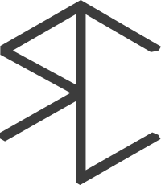

I'm a french engineer (Science and Technology of Telecommunication) with a Ph.D in computer science applied to Geographical Information.
I'm interested in [lots of fields](./research_interest) of computer science, mostly about computer vision, computer graphics, machine learning and database/big data, remote sensing and digital humanities.

My [research work](./publi) involves a PhD and [a postdoc]({{ site.baseurl }}) so far.

My [Ph.D]({{ site.baseurl }}) was about inverse procedural street modelling, and was divided in roughly three parts:
 - one part to generate/edit a street model in database called [StreetGen]({{ site.baseurl }}),  [videos](https://www.youtube.com/channel/UCn4KJ6gBgPuVQV3suF4QbjQ) using postgres/postgis.    
 -  one part to deal with massive point cloud in database [Point Cloud Server]({{ site.baseurl }}) and [Implicit LOD]({{ site.baseurl }}) .
 - and one optimisation part to fit a street model to observations extracted from mobile mapping street images/point cloud (chap. 5 in thesis).
 
 I started freelance [consulting and training](./consulting_and_training) on subjects related to my PhD.
 
 
I like [to travel](http://www.laruevibre.org/?lang=en) and gourmet food/drinks.

I have a strong interest in [design](./design_philosophy), and I'm trying to improve my abilities to conduct [design projects](design_projects).

In general, I like manual activities, especially manual craft, such as [leather craft]({{ site.baseurl }}) and [wood working](./woodworking_projects), with several projects such as [cutting boards]({{ site.baseurl }})
, [molkky]({{ site.baseurl }})
, [catpain bed]({{ site.baseurl }})
, etc.

More generally I'm very interested in building things, both manually and digitally (graphism, 3D printing, CNC, etc.) (see my [skills](./skills) and my [resume](./CV) )

My  is insipired by traditionnal french cabinet builder estampille (stamp).
